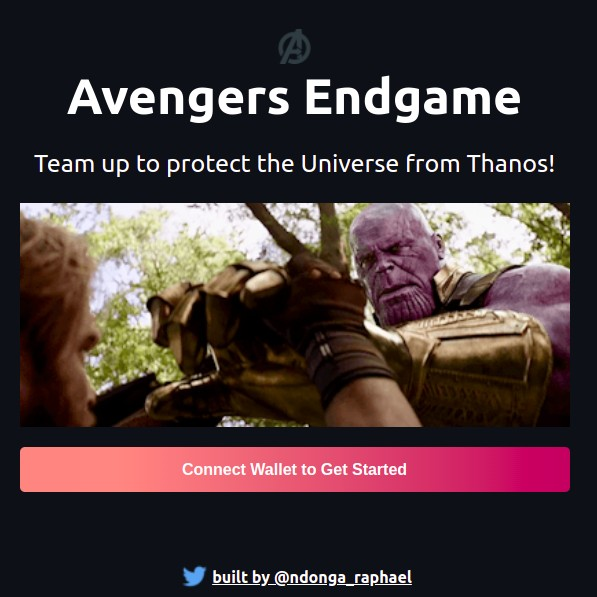

# [Project Link](https://raphaelndonga.github.io/avengers-nftgame-monorepo/)

      <h1>  OPEN LAKE</h1>
     

# Project Functionality
This is an NFT game whereby you select an avenger character and use him to fight thanos.
Since the data is stored on the blockchain, you can invite your friends and collectively defeat thanos.

## Technologies Used
- Hardhat for deploying the Smart Contract to the blockchain
- ReactJS for the UI
